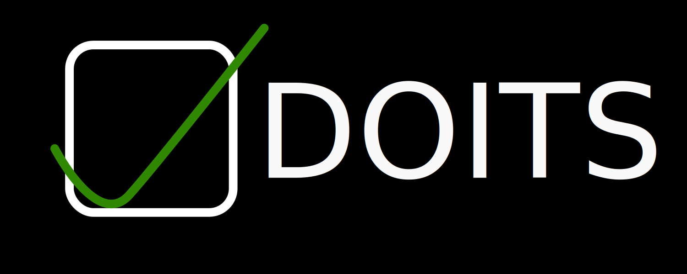

# Python TODO List using Markdown Files

## Requirements

1. Python ( *preferably version `3.12.x+`* )
2. Create a folder `DO_Lists` at `~/Desktop` -> `~/Desktop/DO_Lists`

### Creation of Directory

You need to create a directory at:

```bash
~/Desktop/DO_Lists
```

The folder `DO_Lists` will be the place where all of the markdown files created will be kept.
Therefore, you can refer back to other "*dates*" / files if you have not been able to complete a task(s).

### ZSH / Bash

If you want to call / run the Python File from anywhere in the terminal. You can do:

```bash
# create a function that will run the file user types 'do_list'
do_list() {
    # run the Python file
    python ~/scripts/do_list.py
}
```

>[!NOTE]
>You are going to need directory at `~/scripts` and rename the `main.py` file to `do_list.py`

---

## Story

There is a really great, simple and easy-to-use [Obsidian](https://obsidian.md/) plugin called '[Checklist](https://github.com/delashum/obsidian-checklist-plugin)'

>This is a really nice plugin! If you use Obsidian, you need to check it out.

However, to check my tasks, I always need to boot up Obsidian to view and interact with them.
The reason I use this great plugin is its simplicity. Then again, if every time I will have to start Obsidian to see my tasks; then it starts to slow you down and becomes a pain in the ass.

>Since I'm a sucker for performance, I don't keep a program running if I'm **not** using it.

### My Simple Shitty Solution

>"*Let's go ahead and make a simple Python DO List Program*"

So, I did! This program allows the user to insert tasks into a **Markdown** file, with the file name as the current date.
Hence, the user will then be able to enter his / her tasks and program will write the user's input into the markdown file.

When the user will run the program; he will be prompted to a few options:

1. Create the Markdown File and Insert Tasks
2. Display the *uncompleted* tasks
3. Display the *completed* tasks
4. *Check-Off* / "*Remove*" tasks
5. Exit the program

>[!NOTE]
>When I say "*remove*"; it will not remove / delete that line(s) / task(s) that the user has selected.
>In Markdown to write a task, you simply user:
>
>```markdown
>- [ ] Task
>```
>
>Then after completion of said tasks, you can simply do:
>
>```markdown
>- [x] Task
>```
>
>This means that the task has been **completed**
>
>Hence, we say that the task has been *checked-off* / *removed*!

>[!WARNING]
>I made this *program* so that I can *learn* things and not because I "**needed**" to.
>Nevertheless, the story that I told above $\uparrow$ is true.
>
>Please refer to the `learning.md` file for my _learning experience_ and _struggles_, which provide more information about the code itself.
